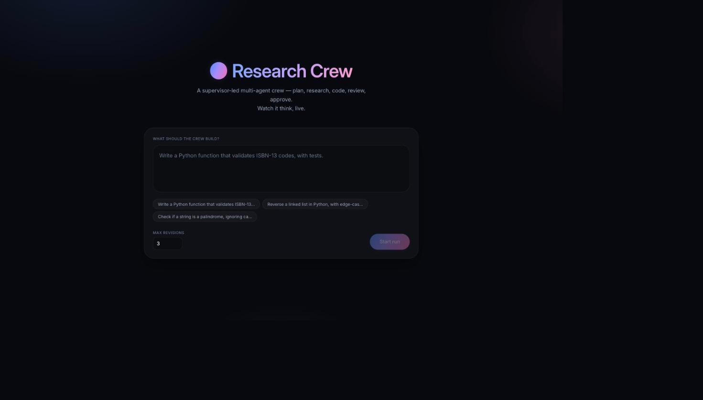
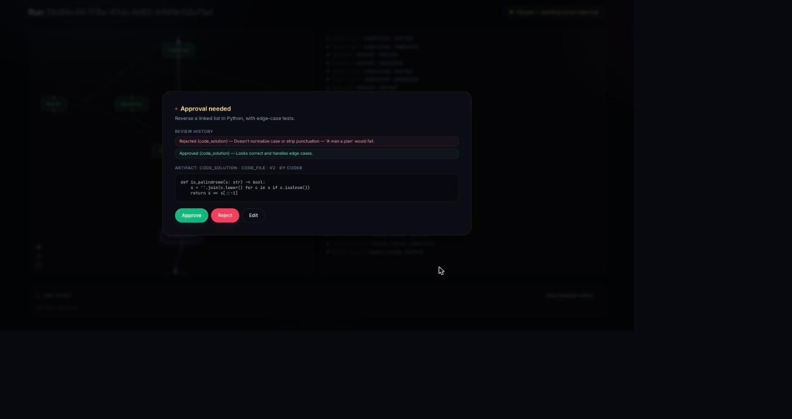
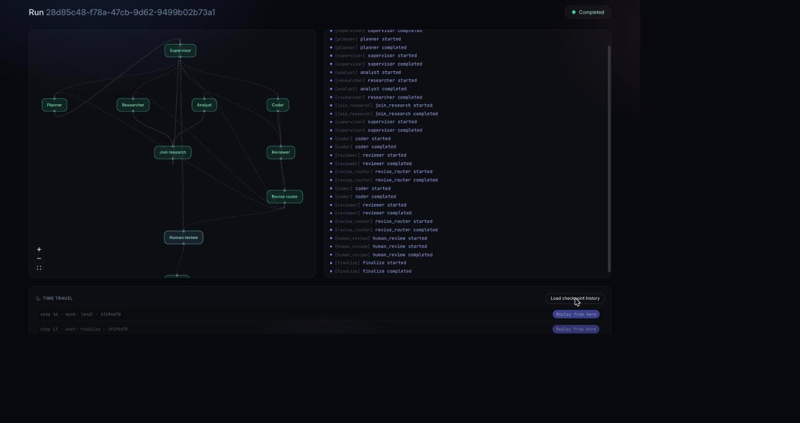

# Research Crew

**Live:** [frontend](https://research-crew-frontend-mrinalcoms-projects.vercel.app) ·
[backend](https://research-crew-backend-two.vercel.app/health) — deployed on Vercel with a
live Neon Postgres checkpointer. **Note:** the deployed backend has no `ANTHROPIC_API_KEY` set
yet, so it boots and serves `/health` but agent runs will fail until one is added
(`vercel env add ANTHROPIC_API_KEY production` from `backend/`, then redeploy).

A supervisor-led multi-agent research/coding crew built on [LangGraph](https://github.com/langchain-ai/langgraph), delivered as a full-stack app: a FastAPI backend running the graph and a React frontend that visualizes it live — graph topology, streaming agent activity, human-in-the-loop approval, and checkpoint time-travel.

This isn't a single-chain chatbot wearing a graph as costume. It exists to demonstrate the patterns that separate a production agent from a demo: durable checkpointed execution, a real human-in-the-loop approval gate (not just a chat confirmation), a provably-bounded self-correction loop, concurrent fan-out/fan-in, and time-travel replay.

## What it does

Given a task (e.g. *"write a Python function that checks if a string is a palindrome, with tests"*), a **supervisor** agent routes the work through specialists:

- **planner** — breaks the task into steps
- **researcher** + **analyst** — run **concurrently** to gather findings and synthesize risks
- **coder** — writes and tests code in a sandboxed workspace
- **reviewer** — critiques the latest artifact and can send it back for revision
- **human_review** — a durable pause point where a person approves, rejects, or edits the final artifact before it's finalized

The revision loop is bounded: if the reviewer keeps rejecting, a plain state-arithmetic cutoff (not another LLM call) forces a hand-off to the human once `max_revisions` is hit — this guarantees termination regardless of what any model decides.

## Screenshots

| Landing | Approval gate | Live run |
|---|---|---|
|  |  |  |

The third screenshot shows a completed run: every graph node lit up green, the full node-by-node event log on the right (including the bounded revision loop — the reviewer rejects once, the coder fixes it, the reviewer approves), and the time-travel checkpoint list at the bottom.

## Architecture

```
Langgraph/
  backend/            FastAPI + LangGraph
    app/
      graph/           state schema, graph assembly, routing logic
      subgraphs/        planner / researcher+analyst / coder (ReAct agents)
      agents/            supervisor + reviewer (structured-output LLM calls), prompts, LLM factory
      tools/             sandboxed code exec, path-jailed file I/O, web search
      api/                run lifecycle endpoints (create/stream/resume/history/replay)
      streaming/          astream_events -> SSE translation
      persistence/        checkpointer (SQLite/Postgres) + run metadata store
      observability/      structured logging, LangSmith tracing toggle
    tests/               unit + integration tests (see below)
  frontend/            React + TypeScript + Vite
    src/
      components/graph/    React Flow visualization of the (fixed) graph topology
      components/hitl/       approval modal
      components/history/    run list, time-travel panel
      components/stream/     live message/token log
      state/                  zustand store driven by SSE events
      api/                    REST client + manual SSE parser
  docker-compose.yml    db (Postgres) + backend + frontend
```

### Key design decisions

- **State**: `TypedDict` + `Annotated` reducers for the graph (LangGraph's native idiom), Pydantic v2 for API I/O and structured LLM output. Each specialist keeps its own private scratchpad — only a final `Artifact` and a summary message get written back to shared state.
- **Checkpointing**: SQLite for zero-infra local dev, Postgres (`AsyncPostgresSaver`) in Docker Compose. Verified durable across process restarts and real container restarts (`backend/tests/persistence/`).
- **Human-in-the-loop**: the dynamic `interrupt()` call (not the static `interrupt_before` node list) so the frontend gets a structured payload — the artifact, review history, revision count — to render, not just "a node paused."
- **Streaming**: Server-Sent Events over `graph.astream_events(..., version="v2")`, filtered down to a small stable vocabulary (`token`, `node_status`, `interrupt`, `run_complete`, `error`) — `astream_events` fires for every internal LangChain runnable, so filtering to known top-level node names matters.
- **Sandbox**: the coder agent executes code via `subprocess` with resource limits, a stripped environment (backend secrets never inherited), and a path-jailed workspace directory — not Docker-in-Docker, not `eval()`. Documented tradeoff below.
- **Time travel**: `GET /runs/{id}/history` and `POST /runs/{id}/replay_from/{checkpoint_id}` are thin wrappers over `checkpointer.get_state_history()` / forking from an arbitrary checkpoint — cheap to build directly off LangGraph's own APIs.

## Deploying it for free

See [DEPLOY.md](DEPLOY.md) — Vercel (frontend) + Render (backend) + Neon (Postgres), all permanent free tiers, no credit card required.

## Running it

### Docker Compose (recommended)

```bash
cp .env.example .env
# edit .env: set ANTHROPIC_API_KEY (or switch LLM_PROVIDER=openai + OPENAI_API_KEY)
docker compose up --build
```

- Backend: http://localhost:8001 (container port 8000, mapped to host 8001)
- Frontend: http://localhost:5173
- Postgres: exposed on host port 5434 (mapped from container's 5432)

> Host ports were chosen to avoid colliding with other local projects — adjust in `docker-compose.yml` if needed.

### Manual local dev

```bash
# backend (creates a venv, installs deps, runs uvicorn --reload)
./scripts/dev_backend.sh

# frontend (separate terminal)
./scripts/dev_frontend.sh
```

Without `DATABASE_URL` pointing at Postgres, the backend falls back to a local SQLite checkpointer — no Docker required to develop against.

### Running tests

```bash
cd backend
./.venv/bin/python -m pytest        # unit + integration tests, no external services needed
```

The Postgres durability test (`tests/persistence/test_postgres_checkpointer.py`) auto-skips if no Postgres is reachable; run `docker compose up -d db` first to include it.

## The code-execution sandbox

The coder agent can run Python via a `run_python` tool. It's deliberately **subprocess + rlimits + a path-jailed workspace**, not a full container-per-execution sandbox:

- Each run gets its own `workspaces/{run_id}/` directory; all file tool calls are resolved and rejected if they'd escape it.
- The child process gets a stripped environment (`PATH` only) so backend API keys are never visible to executed code.
- CPU time, memory, and file-descriptor limits are applied via `resource.setrlimit` where the platform supports it; a wall-clock `subprocess` timeout is the backstop everywhere.

This is appropriate for a personal/demo project, not for running untrusted code from multiple tenants. For that, swap `app/tools/code_exec.py` for a real per-execution container (gVisor, Firecracker, or a Docker-per-exec runner).

## Observability

- Structured JSON logs (`structlog`) at run lifecycle points (created/resumed/completed/failed) and node-level start/completion.
- LangSmith tracing: set `LANGCHAIN_TRACING_V2=true` and `LANGCHAIN_API_KEY` in `.env` to get full trace visibility into every LLM call and tool invocation.

## API surface

| Method | Path | Purpose |
|---|---|---|
| `POST` | `/runs` | Create a run |
| `GET` | `/runs` | List runs (newest first) |
| `GET` | `/runs/{id}` | Run summary |
| `GET` | `/runs/{id}/stream` | SSE stream — starts the run if fresh, or reports "waiting" if already paused |
| `POST` | `/runs/{id}/resume` | Resume a paused run with `{decision: approve\|reject\|edit, edited_content?}` — itself returns an SSE stream |
| `GET` | `/runs/{id}/history` | Checkpoint history for the run |
| `POST` | `/runs/{id}/replay_from/{checkpoint_id}` | Fork execution from an earlier checkpoint |

All endpoints except `/health` require an `X-API-Key` header matching `API_DEV_KEY` — a single dev-mode key, not a full auth system (out of scope for this project's size).
